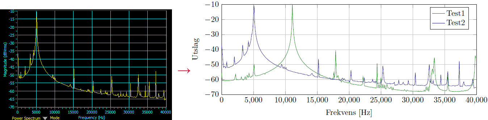

# *National Intstruments* [ELVISmx](http://www.ni.com/en-us/shop/engineering-education/engineering-lab-stations/ni-elvis-engineering-lab-workstation/what-is-ni-elvis.html) data to `.csv` converter

The NI myDAQ uses NI's own software, ELVISmx, to capture and plot data from the oscilloscope. Unfortunately, IMHO, the exporting capabilities of ELVISmx is simply not good enough at the time this project was created (early 2016). It allowed to export either as ugly, preformatted images of the data-plots, or through their own obscure file formats. It was impossible to compare data aquired at different times and offered no control to the user. As this equipment often is used by students, this script converts ALL output types from ELVISmx to `.csv`. Those can later be plotted and custumized eg. in TikZ, MatLab, PyPlot, etc.

## Modes

* Bode plots are exported from ELVISms as `.txt`-files.
* Data logger records are exported as `.lvm`.
* Dynamic Signal Analyzer records are `.txt`
* Oscilloscope data is exported as `.txt`

## How to use

Compile and build the project and run the executable, and take it from there. Argument passing is not supported. Pre-built Windows executable is provided, if you dare to trust me and run it. The software navigation is done through the terminal, without any error handling whatsoever. Some user maturity is assumed. For modes where dual channel data aquisition is possible, the user must choose the correct mode for the specific scenario. The script is simple and dumb.

## Example of usecase

Say you want to compare the frequency response of two (or more) filters. Using ELVISmx gives you the plot to the left, and you would have to present n such plots. After using this script and plotting it in TikZ one can achieve the result to the right. Although I forgot to fix the y-axis label, the appearance is much cleaner and usable.

## Further development

No. Written after an introductory course in C++ and I know the code is messy and redundant. But it works.
